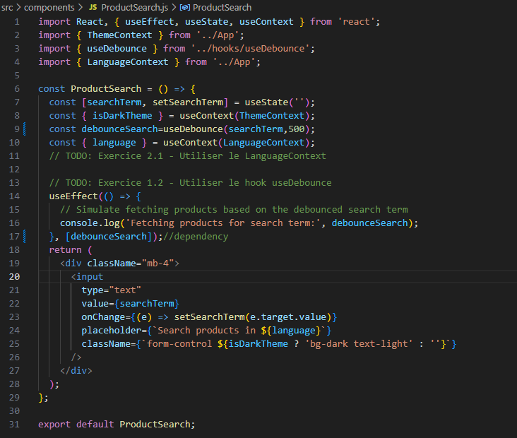

# TP React Hooks - Application de Gestion de Produits

### Exercice 1 : État et Effets 
 I created a useEffect that reacts to useDebounce when the useState changes every 500ms

### Exercice 2 : Context et Internationalisation
I creating a LanguageContext using the createContext hook. This context was used to manage the current application language, allowing other components to easily access and update the language state. Within the App component, we used the useState hook to manage the language state and provided the current language and a toggleLanguage function to the LanguageContext.Provider. This enabled other components to consume the language context and adjust their behavior or display content accordingly.

### Exercice 3 : Hooks Personnalisés
I created two personalised hooks:   
1.
2.
